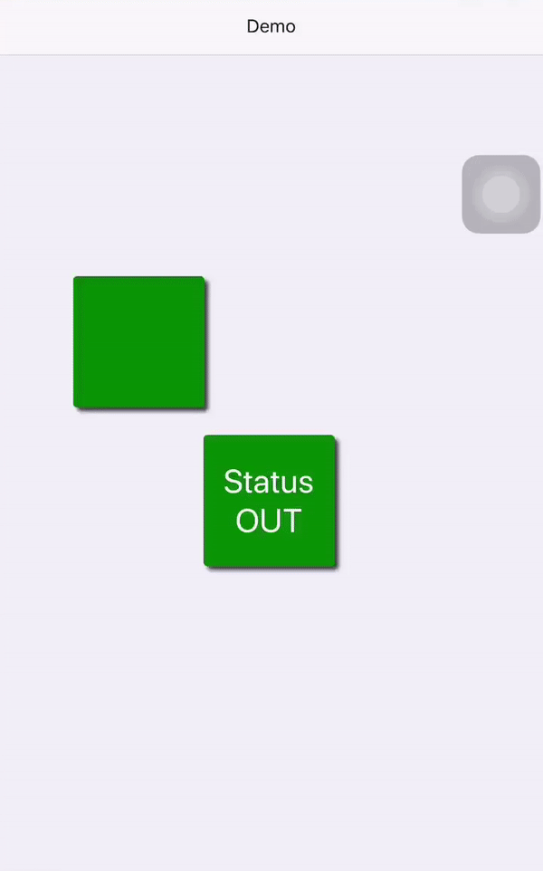

React Native Drag
===

A components wrapper makes them draggable.

## Usage

Install library via `npm`

```
npm install react-native-drag
```
To make components draggable, simply wrap them in a `Draggable` component.

```jsx
import Draggable from 'react-native-drag';

<Draggable 
  setRef={this.setRef} 
  containerStyle={styles.draggable} 
  onDragStart={this.handlePressIn} 
  onDragRelease={this.handlePressOut}
  onLongPress={this.handleLongPress} 
  longPressTimeout={500} 
>
  <View>
    <Text>Hello World!</Text>
  </View>
</Draggable>
```

## API

### Properties
| Porperty | Description | Type | Default |
| -------- | -------- | -------- | -- |
| containerStyle | specify style for the wrapper | number, object | -- |
| longPressTimeout | specify timeout to invoke `onLongPress`  | number | 500 |

### Callback
| Event | Description | Type | Parameters |
| -------- | -------- | -------- | -- |
| onDragStart | invoke when press in | func | none |
| onDragRelease | invoke when press out and with the latest screen coordinates of the recently-moved touch | func | (lastX, lastY) |
| onLongPress | invoke after a specified `longPressTimeout` | func | none

### Get Component Reference

Use a `setRef` function to get the draggable component's ref.  
All props send to `Draggable` will also send to the wrapper `View` component.

```jsx
class Demo extends React.Component {
  setRef = (r) => {
    this.myDraggable = r;
    console.log(this.myDraggble.props.id) // 123
  }
  render() {
    return (
      <Draggable id={123} setRef={this.setRef}>
        <View />
      </Draggable>
    )
  }
}
```

## Demo

Codes in `example/Demo.js`




